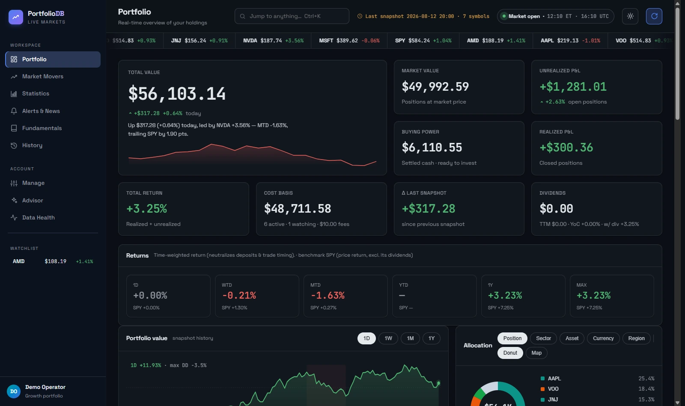
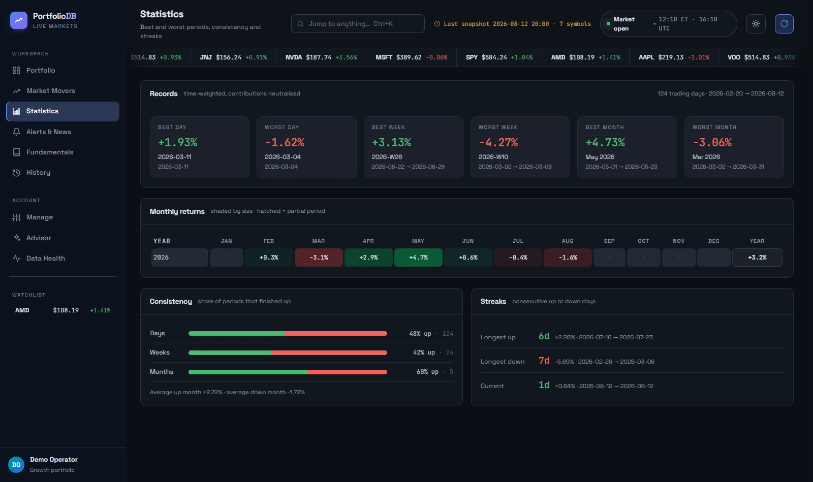
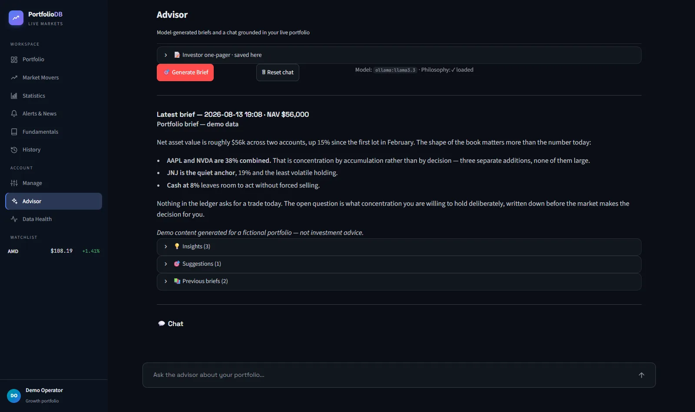
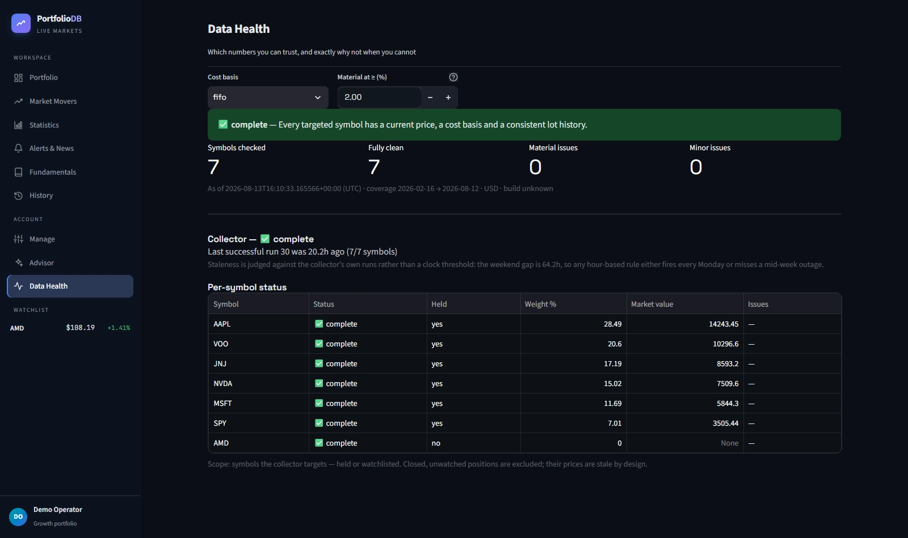

# PortfolioDB

**An append-only, lot-based portfolio ledger you own.** Postgres is the source of
truth, FIFO and average-cost engines recompute everything on read, an optional
advisor reads your written investment philosophy before it says anything, and an
MCP server lets your own AI agents query the whole thing. Self-hosted,
single-user, no accounts, no telemetry, no broker credentials.

Runs anywhere Docker runs: `make init && make up` and you have a dashboard on
port 8501.

> **Not investment advice.** This is a record-keeping and analysis tool. It
> reports what your ledger says and, if you enable the advisor, what a language
> model thinks about it — neither is financial advice, and language models state
> wrong things confidently. Verify anything that would move money. You are the
> only decision-maker, and you own the consequences.



<details>
<summary>More screens — statistics, advisor, data health</summary>

**Statistics** — best and worst periods, monthly returns, consistency and streaks:



**Advisor** — a brief generated against your ledger and your written philosophy,
which you paste straight into the page. Works with Anthropic, OpenAI,
OpenRouter, or a local model through Ollama:



**Data Health** — per-symbol answers to "can I trust this number, and if not
why not": price freshness judged against the collector's own runs, missing cost
basis, orphaned sells, suspected splits:



</details>

<sub>Screens show `make demo-seed` data: a fictional portfolio with
random-walk prices, not anyone's holdings.</sub>

---

## What it does

- **Lots**, not positions: every BUY/SELL is a row. Open quantity, cost basis, and realized P&L are always recomputed from `lots` on read — never persisted. FIFO and moving-average engines run side-by-side.
- **Price snapshots** collected on a schedule inside the stack (via yfinance) during a collector window you configure. Append-only `(symbol, ts)` PK. Quotes that are stale upstream are rejected rather than written under a fresh timestamp, and vendor-reported splits are recorded to `corporate_actions`.
- **Splits adjusted at read time**: `corporate_actions` is the source of truth and `lots`/`price_snapshots` are never rewritten, so the append-only invariant holds and an adjustment is undone by deleting its row.
- **Streamlit dashboard** with KPIs, holdings, equity curve, market movers, period statistics (best/worst day, week and month, consistency, streaks), fundamentals, news, a data-health panel, an Advisor tab, and a one-click HTML executive report.
- **Advisor layer** (optional): injects your `philosophy.md` + live portfolio snapshot + recent chat into every model call. Works with Anthropic, OpenAI, OpenRouter, or a **fully local model via Ollama** — so your financial data can stay on your machine, LLM included. Persists structured briefs to `advisor_briefs`. Streaming chat in the dashboard. See [docs/llm-providers.md](docs/llm-providers.md).
- **Fundamentals enrichment** (optional): a weekly pull from Financial Datasets populates `fd_*` tables (company facts, financial metrics, earnings, filings, insider trades, institutional ownership, news).
- **MCP server** (optional): exposes positions, P&L, KPIs, prices, fundamentals, risk analytics, trade quality, data-quality diagnostics and a consolidated portfolio review to AI agents (Claude Code, Claude Desktop, Cursor) over Streamable HTTP with Bearer auth. Read-only — same engines as the dashboard. See [MCP server](#mcp-server) below.

---

## Stack

- **Postgres 16** in Docker; the database lives in a named volume (`pgdata`)
- **One application image** for every service — dashboard (Streamlit), scheduler
  (supercronic), MCP server (uvicorn), and the CLIs
- Python 3.13 in the image; `psycopg2`, `pandas`, `yfinance`, `streamlit`,
  `plotly`, and whichever LLM SDK your provider needs
- No cloud dependencies. Price data comes from yfinance; everything else is
  yours and stays local.

---

## Quick start

You need Docker with Compose. Nothing else: the application image is **pulled,
not built**, so there is no Python, no toolchain, and no compile step on your
machine.

### 1. Make a directory and fetch two files

```bash
mkdir portfoliodb && cd portfoliodb
curl -fsSLO https://raw.githubusercontent.com/amosgeva/PortfolioDB/main/docker-compose.yml
curl -fsSL  https://raw.githubusercontent.com/amosgeva/PortfolioDB/main/.env.template -o .env
```

Optionally a third, if you want the shortcuts (`make positions`, `make backup`, …):

```bash
curl -fsSLO https://raw.githubusercontent.com/amosgeva/PortfolioDB/main/Makefile
```

### 2. Configure `.env` before starting anything

```bash
$EDITOR .env
```

Two values matter for a first start; everything else can stay empty:

| Key | What to put |
|---|---|
| `POSTGRES_PASSWORD` | Any strong password you invent — it only has to match the next line |
| `PORTFOLIODB_PASSWORD` | **The same value.** Compose gives the first to Postgres; the app reads the second |

Worth setting now if they apply to you:

| Key | Why |
|---|---|
| `PORTFOLIODB_TZ` | Your IANA zone (e.g. `Europe/Berlin`). The collector window defaults are UTC-shaped, so on another zone the daily numbers will not line up ([scheduling](docs/scheduling.md)) |
| `LLM_API_KEY` | Enables the advisor. Any provider — Anthropic, OpenAI, OpenRouter, or a local model with no key at all ([providers](docs/llm-providers.md)) |
| `PORTFOLIODB_MCP_TOKEN` | Only if you plan to let AI agents query the ledger |

Then keep it private: `chmod 600 .env`.

### 3. Start it, create the tables, and look around

```bash
docker compose up -d
docker compose run --rm dashboard python app/apply_schema.py
docker compose run --rm dashboard python app/demo_seed.py --yes   # optional demo data
```

Open <http://localhost:8501>.

With the Makefile those three become `make up`, `make schema`, `make demo-seed`,
and `make` on its own lists every target.

To upgrade later: `docker compose pull && docker compose up -d` then
`apply_schema.py` again (it is idempotent). Pin a version instead of tracking
`latest` with `PORTFOLIODB_IMAGE=ghcr.io/amosgeva/portfoliodb:v1.0.0` in `.env`.

<details>
<summary>Prefer to clone, or want to work on the code?</summary>

```bash
git clone https://github.com/amosgeva/PortfolioDB.git && cd PortfolioDB
make init          # .env + philosophy.md, with a generated password and MCP token
make up
make schema
```

`make init` does the `.env` copy, password generation and `chmod` for you — it
is the only thing cloning buys you for a plain install.

To build the image from source instead of pulling it, use the committed dev
overlay: `make build` then `make dev-up`.

</details>

Then, in whatever order suits you:

- **Enter your own trades** — Manage page, or
  `make add-lot ARGS="--symbol NVDA --account IBKR --trade-date 2026-02-13 --side BUY --qty 10 --price 184"`.
  Have history in a spreadsheet? [docs/csv-import.md](docs/csv-import.md).
- **Set your timezone and collector window** — Manage → Settings. The defaults
  are UTC-shaped; if you're not on UTC, set them before trusting the daily
  numbers ([docs/scheduling.md](docs/scheduling.md)).
- **Turn on the advisor** — put an API key in `.env`
  ([docs/llm-providers.md](docs/llm-providers.md), including fully-local Ollama),
  then give it your investing rules: paste the prompt from
  [docs/investor-interview.md](docs/investor-interview.md) into any LLM, answer
  its questions, and paste the one-pager it writes into **Advisor → 📝 Investor
  one-pager**. [docs/philosophy.md](docs/philosophy.md) explains what makes a
  good one.
- **Set up backups** before you have data worth losing —
  [docs/operations.md](docs/operations.md).

Machine-specific tweaks — a host directory for the database, a different port,
binding to localhost only — go in `docker-compose.override.yml`; copy
`docker-compose.override.yml.example` to start. Don't put this on the public
internet: it has no login. [docs/exposure.md](docs/exposure.md) covers doing it
safely.

### Documentation

| | |
|---|---|
| [The investor interview](docs/investor-interview.md) | A prompt that interviews you and writes your one-pager |
| [Writing your one-pager](docs/philosophy.md) | What the advisor reads, and what makes it usable |
| [LLM providers](docs/llm-providers.md) | Anthropic / OpenAI / OpenRouter / local Ollama |
| [Scheduling](docs/scheduling.md) | The jobs, the collector window, upgrading |
| [Operations](docs/operations.md) | Backups, restore, upgrades, health checks |
| [Exposure](docs/exposure.md) | LAN-only defaults, tailnet, reverse proxies |
| [CSV import](docs/csv-import.md) | Bulk-loading history from a broker export |
| [Methodology](docs/methodology.md) | How trade quality and fee attribution are computed |

Prefer running Python on the host? That still works: install
`app/requirements.txt`, set `PORTFOLIODB_PASSWORD`, and run the scripts from
`app/`.

---

## Repo layout

```
PortfolioDB/
├── app/                       # Long-lived Python code
│   ├── streamlit_app.py       # Dashboard shell + embedded views
│   ├── modern2_native.py      # Native views (Manage / Advisor / Data Health)
│   ├── dashboard/             # Payload builder + static shell / js / css
│   ├── advisor.py             # Claude-backed brief + chat
│   ├── exec_report.py         # Self-contained HTML executive report
│   ├── portfolio.py           # FIFO/avg-cost merge (single source of truth for positions)
│   ├── fifo.py / avg_cost.py  # Lot-matching engines (per-match fee attribution)
│   ├── twr.py / holdings.py   # Time-weighted return + historical holdings
│   ├── xirr.py                # Money-weighted return (investment-level)
│   ├── period_stats.py        # Best/worst period statistics
│   ├── corporate_actions.py   # Read-time split adjustment + detection
│   ├── check_splits.py        # Split scanner, cross-checked against the vendor
│   ├── db.py                  # Postgres connection helpers
│   ├── snapshot_prices.py     # yfinance price collector
│   ├── fd_store.py            # Financial Datasets persistence + read API
│   ├── fd_weekly_enrichment.py
│   ├── add_lot.py / sell_lot.py / set_cash.py / set_watchlist.py / positions.py
│   ├── report_portfolio_db.py # Text briefing (daily/EOD)
│   ├── Dockerfile             # Image for the optional MCP service
│   ├── mcp/                   # MCP server — exposes data to AI agents
│   │   ├── server.py          # FastMCP entrypoint, /mcp + /healthz
│   │   ├── auth.py            # Bearer-token verifier
│   │   ├── deps.py            # psycopg2 ThreadedConnectionPool
│   │   ├── services/          # positions, prices, pnl, kpis, activity, analytics,
│   │   │                      # fundamentals, health, cutoff, data_quality, review
│   │   ├── tools/             # @mcp.tool registrations (47 tools)
│   │   ├── resources/         # portfolio:// URIs (7 resources)
│   │   ├── prompts/           # Pre-built analyses (7 prompts)
│   │   └── tests/             # 285 tests incl. KPI parity + reconciliation
│   └── tests/                 # 209 tests (engines, splits, TWR, XIRR, stats)
├── sql/
│   ├── schema.sql             # Core tables: instruments, lots, price_snapshots,
│   │                          # cash_snapshots, income, corporate_actions,
│   │                          # snapshot_runs, chat_log, advisor_briefs
│   └── schema_fd.sql          # Financial Datasets enrichment tables
├── Makefile                   # Entry point for every command (wraps compose)
├── docker/crontab             # What the scheduler service runs
├── docker-compose.yml         # postgres + dashboard + scheduler; mcp/pgadmin behind profiles
├── docker-compose.override.yml.example
├── philosophy.md.template     # Stub for the advisor's operator one-pager
├── .env.template
├── .githooks/                 # Pre-commit: unused imports + both test suites
├── docs/
│   ├── methodology.md         # How every number is computed — read before extending
│   ├── migration-notes.md     # Behaviour changes, with before/after figures
│   └── plan.md                # Scoped portfolio-review plan (complete)
├── CLAUDE.md                  # Guidance for Claude Code working in this repo
└── data/                      # Live Postgres data (gitignored — DO NOT EDIT)
```

---

## Common commands

```bash
# Trades — flags pass through ARGS
make add-lot  ARGS="--symbol NVDA --account IBKR --trade-date 2026-02-13 --side BUY --qty 1 --price 184.00"
make sell-lot ARGS="--symbol NVDA --account IBKR --trade-date 2026-03-01 --qty 1 --price 200.00 --fees 2.50"
make set-cash ARGS="--cash 1000 --account IBKR --note 'manual update'"
make watchlist ARGS="NVDA AAPL TSM"

# Positions, jobs, reports
make positions
make snapshot                      # collect now, ignoring the collector window
make brief                         # generate + persist an advisor brief
make ask ARGS="any concentration risk right now?"
make report

# Operations
make backup                        # gzipped pg_dump into backups/
make psql
make logs ARGS=scheduler
make test                          # both suites, inside the container
```

Each target is a thin wrapper — `docker compose run --rm dashboard python app/positions.py`
and friends work directly if you prefer. Running the Python on the host also
works: install `app/requirements.txt`, set `PORTFOLIODB_PASSWORD`, and run the
scripts from `app/`.

---

## Data model

Four core tables, all append-only:

- **`instruments`** — symbol registry. `watchlist=TRUE` keeps a symbol in the snapshot rotation even when no lots are open.
- **`lots`** — every BUY/SELL trade. `side` + positive `quantity` encode direction; a unique index on `(symbol, account, trade_date, quantity, price)` is a best-effort dedupe guard for CSV imports.
- **`price_snapshots`** — time-series quotes, PK `(symbol, ts)`.
- **`cash_snapshots`** — manual cash balances per account (no broker auto-pull). Latest row per `account` wins.

Plus advisor-layer tables (`chat_log`, `advisor_briefs`) and the optional Financial Datasets enrichment tables (`fd_*`).

There is **no positions table.** Recomputing from `lots` on every read is the design.

---

## Conventions

- Monetary math uses `Decimal` end-to-end inside the engines. `float` is only used at the display layer.
- Symbols are stored and compared uppercase; CLIs uppercase user input before querying.
- BUY fees inflate cost basis; SELL fees reduce proceeds. Shorts are not supported — a SELL exceeding open BUYs logs a warning and is truncated.
- Matching is scoped to `(symbol, account)`; cross-account fungibility is intentional only at the merge step in `portfolio.compute_fifo_merged`.

---

## MCP server

PortfolioDB ships an [MCP](https://modelcontextprotocol.io) server that exposes the same portfolio data the dashboard renders — positions, P&L, KPIs, prices, fundamentals, analytics — to AI agents over Streamable HTTP with Bearer auth. Read-only by design; mutations stay on the CLIs.

For any broad "how is the portfolio doing" question, start with **`get_portfolio_review_snapshot`**: it returns summary, returns, benchmark, risk, concentration, attribution and data quality from a *single* cutoff. Chaining the individual tools instead lets each resolve its own "now", which mixes valuations from different moments — the collector writes every five minutes.

The MCP server reuses the same `portfolio.compute_fifo_merged` engine as the dashboard, and a parity test (`app/mcp/tests/test_kpi_parity.py`) asserts every KPI tile matches what Streamlit shows.

### What's exposed

| Surface | Count | Examples |
|---|---|---|
| **Tools** | 47 | `get_portfolio_review_snapshot` (everything from one cutoff — start here), `get_data_quality`, `get_trade_quality`, `get_portfolio_kpis`, `get_positions`, `get_realized_pnl`, `get_unrealized_pnl`, `compare_methods`, `get_price_history`, `get_top_movers`, `get_concentration`, `get_allocation`, `get_correlation_matrix`, `get_drawdown_stats`, `get_period_returns`, `get_benchmark_comparison`, `get_company_facts`, `get_lots`, `get_cash_balance`, … |
| **Resources** | 7 | `portfolio://summary`, `portfolio://positions/current`, `portfolio://kpis/today`, `portfolio://schema`, `portfolio://conventions`, `portfolio://reports/executive/latest`, `portfolio://philosophy` |
| **Prompts** | 7 | `morning_brief`, `analyze_concentration_risk`, `review_recent_activity`, `compare_methods_brief`, `pre_trade_check`, `fundamentals_brief`, `drawdown_review` |

### Setup

Add two keys to `.env` (the MCP server reads them on startup):

```env
PORTFOLIODB_MCP_TOKEN=<long-random-string>   # required — clients send as Bearer
PORTFOLIODB_MCP_PORT=8765                    # optional, default 8765
PORTFOLIODB_MCP_HOST=0.0.0.0                 # optional, default 0.0.0.0
```

Generate a strong token:

```powershell
$bytes = New-Object byte[] 32
[System.Security.Cryptography.RandomNumberGenerator]::Create().GetBytes($bytes)
[System.Convert]::ToBase64String($bytes).TrimEnd('=').Replace('+','-').Replace('/','_')
```

Install deps (adds `fastmcp` + `uvicorn` on top of the dashboard's requirements):

```powershell
pip install -r app\requirements.txt
```

### Run it

```bash
make mcp                 # starts the mcp service on 127.0.0.1:8765
curl -s localhost:8765/healthz
```

It sits behind a compose profile because most installs won't want a second
network listener. The equivalent long form:

```powershell
docker-compose --profile mcp up -d mcp
```

Liveness check (unauthenticated, for tunnels / health probes):

```
GET http://127.0.0.1:8765/healthz
```

### Connect an agent

**Claude Code (CLI):**

```bash
claude mcp add portfoliodb \
  --transport http \
  --header "Authorization: Bearer $PORTFOLIODB_MCP_TOKEN" \
  http://127.0.0.1:8765/mcp
```

Confirm it registered:

```bash
claude mcp list
```

**Claude Desktop / Cursor / other clients** — add to your MCP servers config:

```json
{
  "mcpServers": {
    "portfoliodb": {
      "url": "http://127.0.0.1:8765/mcp",
      "transport": { "type": "streamable_http" },
      "headers": { "Authorization": "Bearer <PORTFOLIODB_MCP_TOKEN>" }
    }
  }
}
```

**Programmatic test (Python):**

```python
import asyncio
from fastmcp import Client

async def main():
    async with Client("http://127.0.0.1:8765/mcp", auth="<TOKEN>") as c:
        kpis = await c.call_tool("get_portfolio_kpis", {})
        print(kpis.structured_content)

asyncio.run(main())
```

### Trying it out from an agent

Once connected, ask the agent things like:

- *"What's my portfolio status right now?"* → uses `get_portfolio_kpis` + `portfolio://summary`
- *"Run a concentration check"* → invokes the `analyze_concentration_risk` prompt
- *"How would buying 5 more NVDA at $170 affect my portfolio?"* → invokes `pre_trade_check`
- *"Give me a one-page brief on NVDA"* → invokes `fundamentals_brief`
- *"Which of my holdings are most correlated?"* → `get_correlation_matrix`
- *"Compare FIFO vs avg-cost realized P&L"* → `compare_methods` or `compare_methods_brief`

Resources are loaded automatically by some clients (Claude Desktop) for ambient context, or you can read them explicitly via `portfolio://<uri>`.

### Tests

The two suites need **different working directories**. The MCP suite imports
`app.mcp...` and must run from the repo root; running it from `app/` puts the
local `app/mcp/` package on the path as top-level `mcp`, shadowing the official
SDK that fastmcp needs.

```powershell
# From repo root — 285 tests
python -m pytest app\mcp\tests\ -m "not slow"   # 252, no database needed
python -m pytest app\mcp\tests\ -m slow          # 33, live Postgres, ~30s

# From app/ — 209 tests (engines, splits, TWR, XIRR, period stats)
cd app; python -m pytest tests\
```

Two suites carry most of the weight. `test_kpi_parity.py` asserts MCP KPIs are
byte-identical to the dashboard's inline math on a deterministic fixture.
`test_reconciliation.py` runs the real services against real data and asserts the
relationships that must always hold — portfolio value equals invested plus cash,
allocation weights sum to invested market value, gross minus fees equals net, and
every endpoint given the same cutoff agrees.

Enable the pre-commit hook once per clone (hooks are not cloned). It runs an
unused-import check on staged files plus both suites:

```powershell
git config core.hooksPath .githooks
```

---

## Privacy notes

- `philosophy.md` is **gitignored.** It contains personal financial context. Use the `.template` to start; edit the real file locally.
- The database lives in the `pgdata` named volume (or a directory you point at via an override). Postgres owns it — never edit, move, or delete files inside it while the stack is running.
- `.env`, `cache/`, `backups/`, and `archive/` are gitignored.
- Nothing phones home. The only outbound requests are yfinance price lookups, your LLM provider if you enable the advisor, and Financial Datasets if you enable enrichment.

---

## Scope and limitations

Known and deliberate, so you can decide before you invest an evening:

- **Single currency.** The engines assume one currency end to end. If you hold
  instruments in several, the totals are arithmetic on mixed units — wrong, not
  approximate. Multi-currency (FX table, per-lot currency, translated cost basis)
  is the top roadmap item and touches every engine, so it will not be a patch.
- **No broker sync.** You enter trades, or import a CSV. There is no Plaid, no
  IBKR Flex, no scraping — by design: no third party gets credentials to your
  brokerage, and the ledger can't be silently rewritten by an integration.
- **Equities, ETFs, and anything yfinance quotes.** No options, bonds, or
  crypto-native accounting. You *can* record them as lots and they will value if
  yfinance has a symbol, but there is no options-specific handling.
- **No authentication.** Single-user by design; the network is your access
  control ([docs/exposure.md](docs/exposure.md)). Built-in auth is post-1.0.
- **Cash is manual.** Latest snapshot per account wins. No auto-pull.
- **Shorts are not supported.** A SELL exceeding open BUYs is truncated with a
  warning; the Data Health page reports it as an orphaned sell.
- **One person's tool.** It is used daily by its author, which is why the
  correctness work is real — and also why the roadmap follows one portfolio's
  needs. Issues that argue for something different are welcome.

---

## License

[AGPL-3.0](LICENSE). Self-host it, modify it, use it for anything — but if you
run a modified version as a service for other people, those modifications have to
be published too. The point is that a ledger you own stays a ledger you own.
